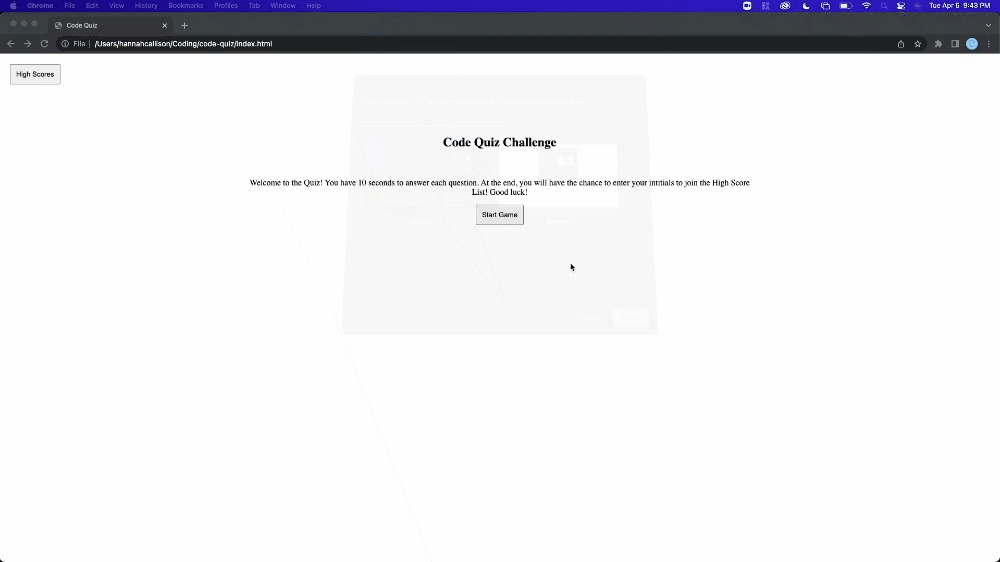

# Code Quiz

## Introduction

For this project we were asked to make a quiz. Using JavaScript we needed to create an interactive timed quiz that tested our advanced Javascript skills. Elements of this project included mulitple choice questions, a timer, and the ability to save a high scores list.

## Webpage Ability
By entering the web page users are given brief instructions and a start button. Once the start button is clicked the timer begins they have 10 seconds to answer 10 simple questions. When an answer button is clicked the other answers are disabled leaving only the next button, which triggers the next question function. At the end of the quiz users can enter their name into an input to have their name listed alongside their score. Clicking the high score button in the top left-hand corner gives users the ability to see the high score list.

## High Score List Shortcomings
The high score list was a very big challenge for me. Once I had completed my quiz structure and timer I spent the rest of the time fiddling with local storage and failing to produce a working high score list. Users are able to enter in their name at the end of the quiz and it does stores locally alongside their score, however I was unable to create an li based on the stored information.

## Product Screenshot gif
he following animation demonstrates the application functionality:

**Link to published password generator:** 
https://hannahcallison.github.io/code-quiz/
